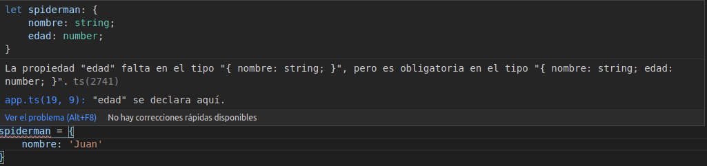
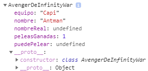

# Curso base de Typescript

* [Comandos básicos](#comando-básicos)
* [Variables Let y Const](#variables-let-y-const)
* [Tipos de variables](#tipos-de-variables)
* [Exclusión de archivos a traducir](#exclusión-de-archivos-a-traducir)
* [Template literales del ES6](#template-literales-del-es6)
* [Funciones: Parámetros opcionales, obligatorios y por defecto](#funciones-parámetros-opcionales-obligatorios-y-por-defecto)
* [Funciones de flecha](#funciones-de-flecha)
* [Desestructuración de objetos y arreglos](#desestructuración-de-objetos-y-arreglos)
* [Promesas](#promesas)
* [Interfaces de Typescript](#interfaces-de-typescript)
* [Clases](#clases)
* [Importación y exportación de módulos](#importación-y-exportación-de-módulos)
* [Decoradores de Clases](#decoradores-de-Clases)


### Comando básicos
*   **`tsc app.ts`:** Genera un JS de archivo TS marcado
*   **`tsc --init`:** Permite generar un archivo de tipo `tsconfig.json`
*   **`tsc -w`:** Permite poner en escucha un proyecto de forma que cualquier cambio realizado en el TS sea inmediatamente agregado al JS

### Variables Let y Const
*    **let:** Permite la declaración de variables valoradas en un scope determinado.
*   **const:** Permite declarar una constante la cual como su nombre lo indica su valor siempre sera el mismo.

> Aunque es valido usar`var` existe la posibilidad de re-declarar la variable dentro del mismo scope, por ello al usar `let` nos evitamos este inconveniente ya que esta función agregada del TS nos permitirá poder reescribir la misma variable en distintos scope sin re-declarar alguna de ellas.

### Tipos de variables
*   **string:** Tipo de datos que permite una cadena de caracteres.
*   **number:** Tipo de dato que permite números.
*   **boolean:** Tipo de dato que permite `true` o `false`.
*   **Date:** Tipo de dato que genera fechas.

Puedes asignar más de un tipo de variable a un `Let`.
```js
let cualquierCosa : string | number | Date;
```
Con esta sintaxis puedes asignar tipos de datos *string, number o Date* a la variable *cualquierCosa*.

En typescript al declarar un objeto con múltiples variables y asignarles valores, por defecto el lenguaje le asignará el tipo de valor, por ejemplo si tenemos
```js
let spiderMan = {
    nombre: 'Peter',
    edad : 30
};
```
Y deseamos volver reasignar nuevamente valores, es requerido que se asigne el valor y el mismo tipo en cada variable, en caso contrario el lenguaje automáticamente te lo marcará como un error dando como resultado.



### Exclusión de archivos a traducir
Al momento de traducir, tenemos la capacidad de obviar archivos y/o directorios, para ello basta con dirigirnos al archivo `tsconfig.json`, agregar el arreglo `exclude` con todos los archivos y/o directorios a excluir
```json
{
    //En este caso estaría excluyendo el directorio de nombre "notas"
    "exclude": ["notas"],
    "compilerOptions": {}
}
```
> Este tipo de exclusiones son comúnes en archivos de respaldo los cuales por razones de espacio uno prefiere no traducirlos

### Template literales del ES6
Los `templates literales` son herramientas del ES6 que nos permitirán construir Strings de manera más practica y sencilla, bastará con colocar los backtips `` seguido del símbolo $ más una llave donde colocaremos la variable/función/operación a leer

```js
const nombre = 'Fernando';
const apellido = 'Antúnez';
const edad = 28;

// Desde JS si deseamos colocar una salida del tipo "Mi nombre es Fernando Antúnez (28)
const salida = 'Mi nombre es ' + nombre + ' ' + apellido + ' (' + edad + ')';

//Usado templates literales bastaría con
const salida = `Mi nombre es ${nombre} ${apellido} ( ${edad} )`;
```

> Usando templates literales podremos llamar funciones y realizar cualquier tipo de operaciones de manera más eficiente

### Funciones parámetros opcionales, obligatorios y por defecto

Al momento de crear una función podemos colocar 3 tipos de parámetros según la necesidad del momento.

* **Parámetros obligatorio**: Son parámetros necesarios que recibe la función los cuales no se pueden obviar.
    ```js
    //Mostrará la "La casa de Fernando."
    function activar ( quien : string, ){
        console.log(`La casa de ${quien}.`);   
    }    
    activar('Fernando');
    ```

* **Parámetros opcional**: Como su nombre lo indica, la variable puede o no ser mandadá, basta con asignar `?:` al parámetro que deseamos que sea opcional.
    ```js
    function activar ( quien ?: string, ) {
        if (quien) {
            console.log(`La casa de ${quien}.`); 
        } else {
            console.log('La casa de Juan');
        }  
    }
    activar('Fernando');
    ```

* **Parámetros por defecto**: En este tipo de parámetro la variable ya tiene un valor asignado el cual puede ser modificado al momento de llamarse.
    ```js
    function activar ( quien : string = 'Juan', ){
        console.log(`La casa de ${quien}.`);   
    }
    // En caso de mandar a llamar sin valor tomaría el que tiene asignado     
    activar();

    // En caso de mandar a llamar con valor tomará el que se le coloque    
    activar('Fernando');
    ```

> La manera o el orden correcto para colocar los parámetros serian
> 1) Parámetros obligatorios
> 2) Parámetros Opcionales
> 3) Parámetros por Defectos.

### Funciones de flecha
Es una sintaxis abreviada que nos permitirá simplificar el ámbito de la función, un buen ejemplo sería al momento que una función solo tiene una linea de código

```js
// Sin usar función flecha retornar a sería
const miFuncion = function (a: string) {
    return a;
}

// Usando función flecha nos quedaría
const miFuncionF = (a: string) => a;
```

Otra ventaja de las funciones de flechas es al utilizar objetos y dentro de los mismos una función, en estos casos si buscamos hacer referencia a un parámetro externo con `this`, se nos puede llegar a imposibilitar según el código que coloquemos

```js

/*  
El this en este código nos marcaría un error ya que 
no reconoce el parámetro 'nombre' debido a que esta
haciendo referencia a la función anónima auto invocada
desde el método "setTimeout"
*/
const hulk = {
    nombre: 'Hulk',
    smash() {
        setTimeout( function () {
            console.log(`${this.nombre} Smash!!!`);    
        }, 1000);
    }
}

/*  
El this en este código funcionaria ya que reconoce el 
parámetro 'nombre' debido a que esta usando función de 
flecha y las mismas no modifican a lo que apunta 'this'
*/
const hulk = {
    nombre: 'Hulk',
    smash() {
        setTimeout(() => {
            console.log(`${this.nombre} Smash!!!`);    
        }, 1000);
    }
}
```

### Desestructuración de objetos y arreglos
Al momento de tener un objeto o arreglo solemos usar
```js
// Objeto y llamada común de cada parte
const aveanger = {
    nombre: 'Steve',
    clave: 'Capitan América',
    poder: 'Droga'
};

console.log(aveanger.nombre);
console.log(aveanger.clave);
console.log(aveanger.poder);

//Arreglo y llamada común de cada posición

const aveangers : string[] = ['Thor','Ironman','Spiderman'];

console.log(aveangers[0]);
console.log(aveangers[1]);
console.log(aveangers[2]);

```
Pero si deseas desestructurar dicho objeto y/o arreglo en ES6 podemos usar
```js
const aveangers : string[] = ['Thor','Ironman','Spiderman'];
const aveanger = {
    nombre: 'Steve',
    clave: 'Capitan América',
    poder: 'Droga'
}

const extraer = ( {nombre, poder} : any) => {
    console.log(nombre);
    console.log(poder);
}
extraer(aveanger);

/*
El espacio en los arreglos da a entender que debe
ignorar las posiciones indicadas, en este caso
tomará la tercera posición del arreglo bajo el nombre
de arana y el console.log(arana) mostrara "Spiderman"
*/
const [,, arana] = aveangers;

//Imitando lo realizado con los objetos
const extraerArr = ( [,, arana] : string[]) => {
    console.log(arana); 
}
extraerArr(aveangers);
```

### Promesas
Las `promesas` representan un resultado eventual de una operación asíncrona, es decir, permitirá ejecutar más de 1 bloque de código al mismo tiempo.
Al momento de usar las promesas se requerirán dos funciones:
*   **`resolve`:** Se retorna cuando la promesa fue realizada de manera exitosa
*   **`reject`:** Se retorna cuando ocurre algún error

```js
const retirarDinero= (montoRetirar : number) =>{
    let dineroActual = 1000;
    return new Promise( (resolve, reject) => {
        if(montoRetirar > dineroActual){
            reject('No hay suficiente fondos');
        }else{
            dineroActual -= montoRetirar;
            resolve(dineroActual);
        }
    } );
}
```

Las promesas son bastante utilizadas al realizar peticiones web, conexiones a BD, etc, las mismas recibirán 2 métodos principales

*   **`then`:** Método callback que devuelve la resolución de la promesa
*   **`catch`:** Método callback que devuelve el rechazo/falla de la promesa

```js
retirarDinero(1500).then((res)=>{
    console.log(`Me quedan ${res}`);        
}).catch((err)=>{
    console.warn(err);        
});
```
En caso de desear definir el tipo de retorno de la promesa bastaría bastaría con colocar después de los argumentos de la función `Promise<Tipo>`, si el dato recibido es del mismo tipo colocado la promesa retornará de manera correcta con el `resolve`, en caso contrario entrará en `reject`

```js
const tipearPromise = ():Promise<number> =>{
    return new Promise((resolve, reject)=>{
        resolve(50);
        reject('No retorno un número');
    }); 
}
```

### Interfaces de Typescript
Las `interfaces` son maneras para establecer reglas que permitan que tanto nosotros como otros compañeros que usen el código deban seguir para utilizarla

```js
interface xMen {
    nombre : string,
    edad : number,
    poder ?: string
};

const enviarMision = (xmen : xMen) =>{
    console.log(`Enviando a ${xmen.nombre} a la misión`);        
};

const wolverine : xMen = {
    nombre : 'Logan',
    edad : 60
};

const ciclope : xMen = {
    nombre : 'Scott',
    edad : 60,
    poder : 'Explosión visual'
};

enviarMision(wolverine);
```

### Clases
Una `clase` es un conjunto de métodos y variables que permite definir instancias con sus mismas características, es una buena practica inicializar las clases en mayúsculas de forma capitalizada 
```js
class AvengerDeInfinityWar{
    nombre: string = '';
    equipo: string = '';
}

// Inicializando una clase
const antMan = new AvengerDeInfinityWar();
```
Un `consutructor` de una clase es el método que se ejecuta cuando creamos un objeto de dicha clase, en el constructor podremos colocar parámetros requeridos, opcionales o por defecto

```js
class AvengerDeInfinityWar {
    constructor(
        public nombre: string,
        public equipo: string,
        public nombreReal?: string,    
        public puedePelear?: boolean,
        public peleasGanadas: number = 1){}
}

const antMan = new AvengerDeInfinityWar('Antman','Capi');
console.log(antMan);
```
>La respuesta obtenida de hacer un console.log a antMan sería
>
>

### Importación y exportación de módulos
Para importar clases de archivos distintos es necesario colocar `export` previo a la clase que deseamos usar en otros archivos, esto permitirá que dicha clase pueda ser usada en otros archivos a través de `ìmport { } from '' `, donde dentro de la desestructuración `{}` colocaremos el nombre de la clase y en `from` la ruta donde se ubica

```js
// Archivo ubicado en la carpeta 'classes/xmen.class.ts'
export class Xmen {
    constructor(
        public nombre: string,
        public clave: string
    ){}
}

// Archivo ubicado en la carpeta 'src/index.ts'
import { Xmen } from './classes/xmen.class'
const wolverine = new Xmen('Logan','Wolverine');
console.log(wolverine);
```

### Decoradores de Clases
Un `decorador` es una función que expande la clase añadiéndole funcionalidades y características propias. Los decoradores los reconocemos ya que se colocan antes de la clase `@decorador`
```js
function imrpimirConsola ( constr: Function ){
    console.log(constr);    
}

@imrpimirConsola
export class Xmen {
    constructor(
        public nombre: string,
        public clave: string
    ){}    
}
```
>Los decoradores se diferencia de los `extends` en que estos no expanden la clase sino que añaden funcionalidad.
